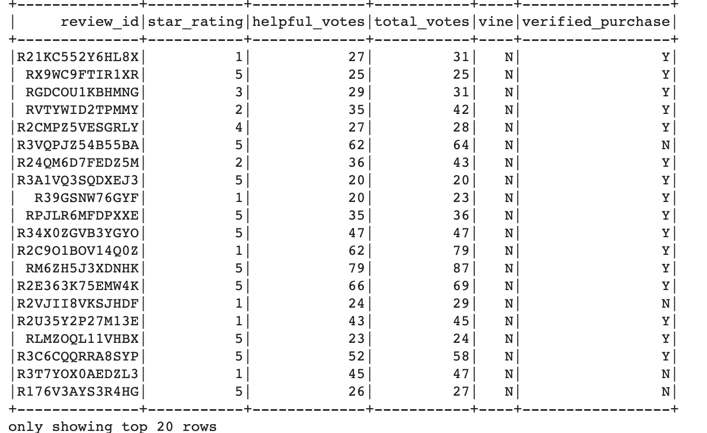

# Amazon_Vine_Analysis
Using PySpark to perform an ETL on Amazon product reviews and determine bias for Vine reviews 

# Overview of the analysis: 
In this anaylsis, I selected an Amazon dataset containing reviews on pet products, and used PySpark to perform an ETL process to extract the dataset, transform the data, connect to an AWS RDS instance, and load the transformed data into pgAdmin. Next, I used PySpark to determine whether there is any bias toward favorable reviews from Vine members vs. unpaid reviews in the dataset.

# Results: 

Below are images of the top twenty rows of two PySpark DataFrames containing the Vine reviews and non-Vine reviews respectively for an Amazon dataset of pet product reviews:  
https://s3.amazonaws.com/amazon-reviews-pds/tsv/amazon_reviews_us_Pet_Products_v1_00.tsv.gz.  

The DataFrames have been filtered to contain only reviews in which the number of helpful votes accounted for at least 50% of the number of total votes for that review. 

| Vine Reviews |  Non-Vine Reviews |
:-------------------------:|:-------------------------:
  |  

- <b>How many Vine reviews and non-Vine reviews were there?</b>  
Using the `count()` function to count the number of rows of both DataFrames, I found there were 170 Vine reviews and 37,840 non-Vine reviews. 
- <b>How many Vine reviews were 5 stars? How many non-Vine reviews were 5 stars?</b>, 
Using the `filter()` function to filter for rows containing 5-star reviews and then the `count()` function to count the number of filtered rows, I found there were 65 five-star Vine reviews and 20,612 five-star non-Vine reviews. 
- <b>What percentage of Vine reviews were 5 stars? What percentage of non-Vine reviews were 5 stars?</b> 
By dividing the number of five-star Vine reviews by the total number of Vine reviews and the number of five-star non-Vine reviews by the total number of non-Vine reviews, I found the percentage of five-star Vine reviews to be <b>38%</b>, and the percentage of five-star non-Vine reviews to be <b>54%</b>.  
# Summary: 

Considering that the analysis found a higher percentage of five-star reviews for non-Vine members than for paid Vine reviews, it seems safe to say that there is no positivity bias for reviews in the Vine program. To be sure, .... statistical test ..... 
Additionally, 
